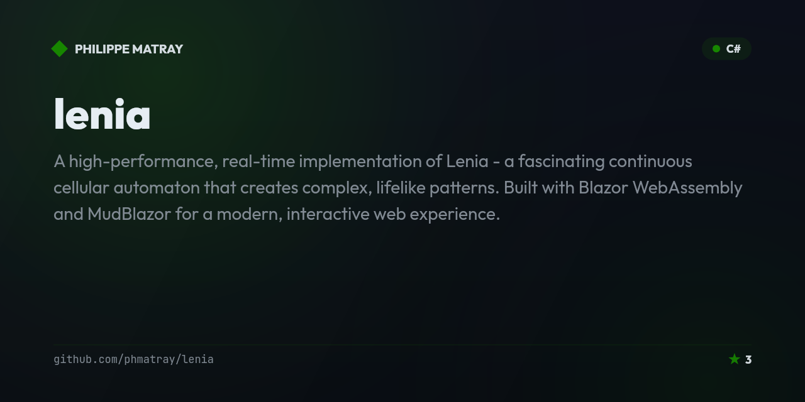
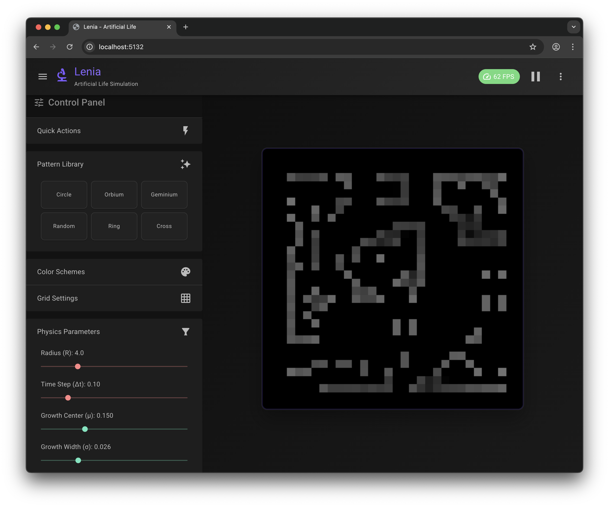

# 🧬 Lenia - Artificial Life Simulation

<!-- portfolio-toc:start -->

## Table of Contents

- [✨ Features](#-features)
- [🎮 Demo](#-demo)
- [🛠️ Technologies](#-technologies)
- [🚀 Getting Started](#-getting-started)
- [🎯 Usage](#-usage)
- [🔬 About Lenia](#-about-lenia)
- [🏗️ Architecture](#-architecture)
- [⚡ Performance Optimizations](#-performance-optimizations)
- [🗺️ Roadmap](#-roadmap)
- [🤝 Contributing](#-contributing)
- [📝 License](#-license)
- [🙏 Acknowledgments](#-acknowledgments)
- [📚 References](#-references)
- [🐛 Issues & Support](#-issues--support)

<!-- portfolio-toc:end -->


[](https://dotnet.microsoft.com/download/dotnet/9.0)
[](https://blazor.net/)
[](https://mudblazor.com/)
[](LICENSE)

A high-performance, real-time implementation of **Lenia** - a fascinating continuous cellular automaton that creates complex, lifelike patterns. Built with Blazor WebAssembly and MudBlazor for a modern, interactive web experience.



## ✨ Features

### 🚀 High-Performance Engine
- **60 FPS Target**: Optimized for smooth real-time simulation
- **Adaptive Quality**: Automatically adjusts processing quality to maintain performance
- **Multi-threaded Processing**: Utilizes all CPU cores for maximum speed
- **Scalable Grid**: Dynamic grid sizing from 24×24 to 128×128
- **Memory Optimized**: Efficient algorithms with minimal allocations

### 🎨 Modern UI
- **Dark Theme**: Professional dark interface with custom purple accent
- **Real-time Metrics**: Live FPS, update time, and render time monitoring
- **Responsive Design**: Works beautifully on desktop and mobile
- **Material Design**: Clean, intuitive interface using MudBlazor components
- **Interactive Controls**: Sliders, buttons, and toggles for all parameters

### 🧪 Scientific Accuracy
- **Authentic Lenia Mathematics**: Implements the original Lenia formulas
- **Configurable Physics**: Adjust radius (R), time step (Δt), growth parameters (μ, σ)
- **Pattern Presets**: Pre-configured Orbium and Geminium patterns
- **Custom Initialization**: Circle patterns and random seeding

## 🎮 Demo

Try the live demo: **[Lenia Simulation](https://phmatray.github.io/Lenia/)**

## 🛠️ Technologies

- **[.NET 9.0](https://dotnet.microsoft.com/)** - Modern, cross-platform framework
- **[Blazor WebAssembly](https://blazor.net/)** - Client-side web UI with C#
- **[MudBlazor](https://mudblazor.com/)** - Material Design component library
- **[JavaScript Interop](https://docs.microsoft.com/en-us/aspnet/core/blazor/javascript-interoperability)** - High-performance canvas rendering

## 🚀 Getting Started

### Prerequisites
- [.NET 9.0 SDK](https://dotnet.microsoft.com/download/dotnet/9.0)
- A modern web browser (Chrome, Firefox, Safari, Edge)

### Installation

1. **Clone the repository**
   ```bash
   git clone https://github.com/phmatray/lenia.git
   cd lenia
   ```

2. **Restore dependencies**
   ```bash
   dotnet restore
   ```

3. **Run the application**
   ```bash
   cd Lenia/Lenia
   dotnet run
   ```

4. **Open your browser**
   Navigate to `https://localhost:5001` or `http://localhost:5000`

## 🎯 Usage

### Basic Controls
- **Play/Pause**: Click the play button in the top bar or main controls
- **Reset**: Clear the grid and start fresh
- **Patterns**: Choose from Circle, Orbium, or Geminium presets

### Physics Parameters
- **Radius (R)**: Neighborhood size for cell interactions (2.0 - 10.0)
- **Time Step (Δt)**: Simulation speed multiplier (0.01 - 0.5)
- **Growth μ**: Peak of the growth function (0.0 - 0.5)
- **Growth σ**: Width of the growth function (0.001 - 0.1)

### Performance Settings
- **Grid Size**: Adjust from 24×24 to 128×128 cells
- **Target FPS**: Set desired frame rate (10-120 FPS)
- **Adaptive Quality**: Auto-adjust processing quality for consistent performance

## 🔬 About Lenia

Lenia is a continuous cellular automaton discovered by Bert Wang-Chak Chan. Unlike traditional cellular automata (like Conway's Game of Life), Lenia uses:

- **Continuous values** instead of binary states
- **Smooth kernels** for neighborhood calculations  
- **Differential equations** for state updates
- **Real-valued time** for fluid evolution

This creates remarkably lifelike behaviors including:
- Self-organization and emergence
- Glider-like moving patterns
- Complex interactions and collisions
- Adaptive and evolutionary dynamics

### Mathematical Foundation

```
Update Rule: A^(t+Δt)(x) = clip(A^t(x) + Δt × G(U^t(x)), 0, 1)

Where:
- A^t(x): Cell state at time t and position x
- U^t(x): Local neighborhood potential
- G(u): Growth function G(u; μ, σ) = 2×exp(-((u-μ)/σ)²/2) - 1
- Δt: Time step size
```

For more details, see the [original paper](https://arxiv.org/abs/1812.05433).

## 🏗️ Architecture

```
├── Lenia/                          # Server-side Blazor Web App
│   ├── Components/
│   │   └── App.razor              # Main application shell
│   ├── Program.cs                 # Server configuration
│   └── Lenia.csproj              # Server project file
│
├── Lenia.Client/                   # Client-side Blazor WebAssembly
│   ├── Components/
│   │   └── LeniaCanvas.razor      # Canvas rendering component
│   ├── Pages/
│   │   └── Home.razor             # Main simulation page
│   ├── Layout/
│   │   └── MainLayout.razor       # App layout with dark theme
│   ├── wwwroot/
│   │   └── leniaCanvas.js         # High-performance canvas rendering
│   ├── LeniaScalable.cs          # Optimized simulation engine
│   ├── Program.cs                 # Client configuration
│   └── Lenia.Client.csproj       # Client project file
│
└── README.md                       # This file
```

## ⚡ Performance Optimizations

### Simulation Engine
- **Float Precision**: Uses `float` instead of `double` for 2× memory bandwidth
- **Pre-computed Kernels**: Kernel weights calculated once and cached
- **Parallel Processing**: Multi-threaded updates using `Parallel.For`
- **Chunked Processing**: Large grids processed across multiple frames
- **Adaptive Quality**: Dynamic reduction of processed cells when needed

### Rendering
- **JavaScript Interop**: Direct canvas manipulation for maximum speed
- **ImageData Optimization**: Efficient pixel buffer updates
- **Hardware Scaling**: GPU-accelerated canvas scaling
- **Minimal Allocations**: Reused buffers and optimized memory access

## 🗺️ Roadmap

- [ ] Add more pattern presets beyond Circle, Orbium, and Geminium
- [ ] Support saving, loading, and sharing custom patterns
- [ ] Investigate WebGL/GPU-accelerated rendering to push past the 128×128 grid ceiling
- [ ] Add automated unit tests for the simulation engine (`LeniaScalable`)
- [ ] Touch controls for painting cells directly on mobile devices

See the [open issues](https://github.com/phmatray/lenia/issues) for what's currently planned.

## 🤝 Contributing

Contributions are welcome! Here's how to get started:

1. **Fork the repository**
2. **Create a feature branch**: `git checkout -b feature/amazing-feature`
3. **Make your changes**: Follow the existing code style
4. **Add tests**: Ensure your changes don't break existing functionality
5. **Commit your changes**: `git commit -m 'Add amazing feature'`
6. **Push to the branch**: `git push origin feature/amazing-feature`
7. **Open a Pull Request**: Describe your changes and why they're awesome

### Development Guidelines
- Follow C# coding conventions
- Use MudBlazor components for UI consistency
- Maintain 60 FPS performance target
- Add XML documentation for public APIs
- Include unit tests for new features

## 📝 License

This project is licensed under the MIT License - see the [LICENSE](LICENSE) file for details.

## 🙏 Acknowledgments

- **Bert Wang-Chak Chan** - Original Lenia research and discovery
- **MudBlazor Team** - Excellent Blazor component library
- **Microsoft** - .NET and Blazor frameworks
- **Blazor Community** - Inspiration and best practices

## 📚 References

- [Lenia - Biology of Artificial Life](https://arxiv.org/abs/1812.05433) - Original paper
- [Lenia and Expanded Universe](https://arxiv.org/abs/2005.03742) - Extended research
- [Bert Chan's YouTube Channel](https://www.youtube.com/c/BertChakovsky) - Lenia demonstrations
- [MudBlazor Documentation](https://mudblazor.com/) - UI component reference

## 🐛 Issues & Support

- **Bug Reports**: [GitHub Issues](https://github.com/phmatray/lenia/issues)
- **Feature Requests**: [GitHub Discussions](https://github.com/phmatray/lenia/discussions)
- **Documentation**: [Wiki](https://github.com/phmatray/lenia/wiki)

---

<div align="center">

**[⭐ Star this repository](https://github.com/phmatray/lenia/stargazers)** if you find it interesting!

Made with ❤️ and lots of ☕ by [Philippe Matray](https://github.com/phmatray)

</div>

<!-- portfolio-nugetkeep:start -->
---
Built by [Atypical Consulting](https://www.atypical.consulting). We also make
[NuGetKeep](https://nugetkeep.com/?utm_source=github-readme&utm_medium=readme&utm_campaign=launch-2026-07),
a self-hosted NuGet server with supply-chain quarantine.
<!-- portfolio-nugetkeep:end -->
